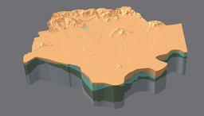
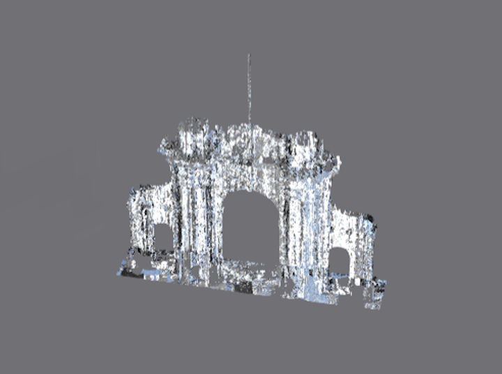
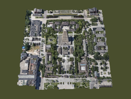
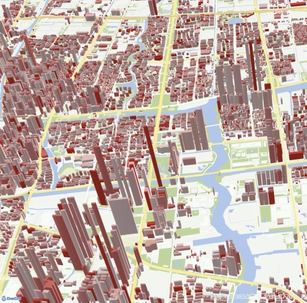

# Model 3D Data&SDK

## 关于

### Version 2.2

`M3D` (Model 3D Data) 是一种开放式、可扩展的三维数据格式，为海量多源异构空间三维模型数据在不同终端之间的传输、交换与共享提供数据格式的具体规范

## 简介

`M3D` (Model 3D Data) 一种开放式可扩展的三维地理空间数据格式，对倾斜摄影数据、人工建模数据、BIM、点云、三维管线、二维/三维点线面等各类数据进行整合，适用于海量、多源异构三维地理空间数据和Web环境下的传输与解析，为多源三维地理空间数据在不同终端（移动设备、浏览器、桌面电脑）地理信息平台中的存储、高效绘制、共享与互操作等问题提供了解决方案。

`M3D` 的主要技术特点和优势可以概括为：

1. 支持表达多源地理空间数据：倾斜摄影模型、BIM、人工建模、激光点云、矢量、地下管线等多源数据。

1. 具备海量数据高效绘制的能力：支持LOD、批次绘制、实例化等技术，可以提升渲染性能。

1. 具备单体化选择和查询能力：支持高效选择、支持批量修改对象颜色、批量修改对象可见性。

1. 简洁易读：格式简洁，易解析，适用于WebGL等轻量级客户端。

1. 高效传输：数据紧凑，以二进制形式保存，占用空间小，传输性能高。

1. 跨终端：独立于任何终端，适用于PC端、Web端、移动端，具有较好的兼容性。

1. 可扩展性：支持扩展，允许增加一些多用途扩展或特定厂商的扩展。

1. 完善的配套设施：完整的解决方案，成熟的可行性，强大的实用性。基于 `M3D` 形成了完整的 `B/S` 及 `C/S` 架构的 `三维GIS` 应用解决方案，从数据生成、服务器端发布到多种客户端加载应用等多个环节解决用户实际问题。

## 效果图

&nbsp;
&nbsp;
&nbsp;

&nbsp;
&nbsp;
&nbsp;

&nbsp;

## 在线服务

[问答社区-云听](http://www.smaryun.com/cloudlisten/index.php)

## 在线示例

[MapGIS Client for JavaScript](http://develop.smaryun.com:8899/#/gallery/cesium)

## 工具

数据生成：[MapGIS for Desktop](http://www.smaryun.com/dev/dev_environment.php#down_package)

数据发布：[MapGIS IGServer](http://www.smaryun.com/dev/dev_environment.php#down_package)

客户端：[WebClient-JavaScript](https://github.com/MapGIS/WebClient-JavaScript), [WebClient-JavaScript-Plugin](https://github.com/MapGIS/WebClient-JavaScript-Plugin), [MapGIS-Desktop-Java](https://github.com/MapGIS/MapGIS-Desktop-Java), [MapGIS-Mobile-React-Native](https://github.com/MapGIS/MapGIS-Mobile-React-Native)

SDK：[M3D_SDK](./M3D_SDK)
